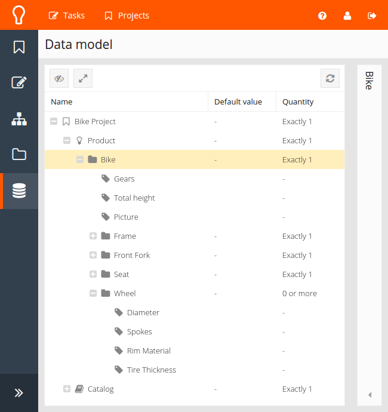
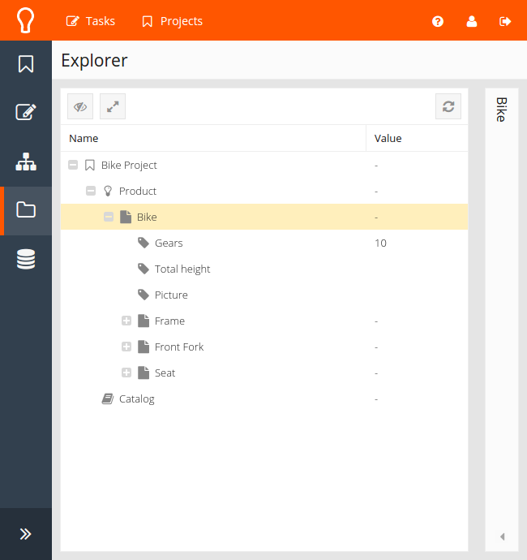
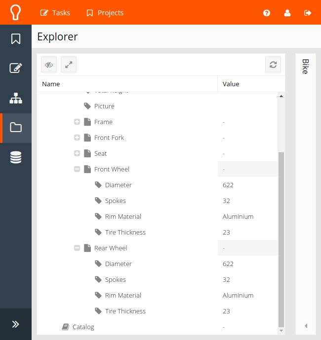

Example: Bicycle wheels
=======================

.. note::
    This example demonstrates a number of features:

    - Creating a client and connecting to KE-chain
    - Retrieving parts and property values
    - Adding new parts to the product tree
    - Setting property values

Considering the following product model and corresponding product.

We would like to add two wheels to the Bike. The desired diameter for each wheel is dependent on the amount of gears;
more gears means bigger wheels (can't argue with this logic). In order to get started, we need to setup a pykechain
:class:`pykechain.Client` and provide valid authentication credentials::

    import pykechain

    kec = pykechain.Client(url='<ke-chain-url>')
    kec.login('<username>', '<password>')

In order to add new wheels, the bike part and wheel model are needed. When opening the right project (scope) to work
in first, it ensures that all parts are returned only from that scope. These parts then can be queried from the project
directly::

    project = kec.scope('Bike Project')

    bike = project.part('Bike')
    wheel_model = project.model('Wheel')

A front wheel and rear wheel can be added as follows::

    front_wheel = bike.add(wheel_model, name='Front Wheel')
    rear_wheel = bike.add(wheel_model, name='Rear Wheel')

We can choose a diameter with a condition around the amount of gears in the bike::

    if bike.property('Gears').value > 7:
        diameter = 622  # mm
    else:
        diameter = 571  # mm

Setting the property values for the two wheels is done easily with a loop::

    for wheel in (front_wheel, rear_wheel):
        wheel.property('Diameter').value = diameter
        wheel.property('Spokes').value = 32
        wheel.property('Rim Material').value = 'Aluminium'
        wheel.property('Tire Thickness').value = 23  # mm

After execution of the script, the product will be modified as shown below:

Alternatively the property values can also be updated using a dictionary and the `update` method of the `Part`::

    wheel.update({'Spokes':32, 'Rim Material':'Unobtanium'})
